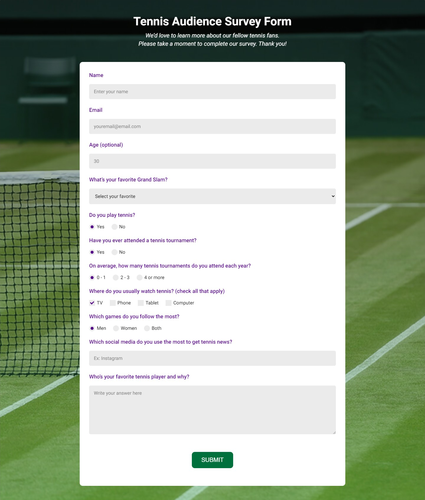
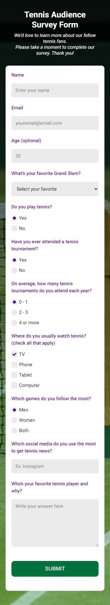
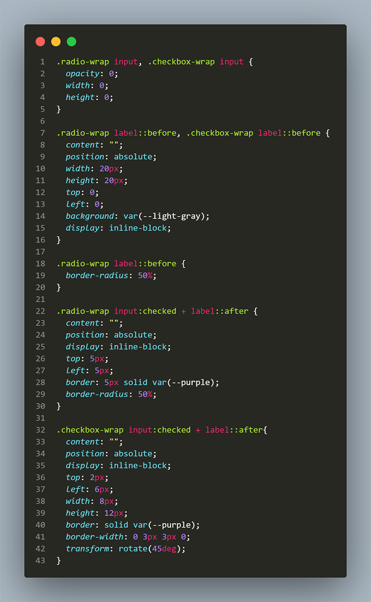
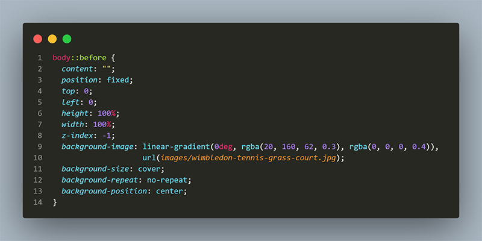

# FreeCodeCamp - Survey Form

Project created for the Responsive Web Design Certification from <a href="https://www.freecodecamp.org/learn">freeCodeCamp</a>.
 

## Layout

### Desktop

  

### Mobile 

   

## What I learned 

 - Custom radio button and checkbox with CSS using label::before and label::after.

  

 - CSS property background-attachment: fixed doesn't work well on mobile. This is the mobile friendly alternative:

***
##### by Juliana Chagas 💜