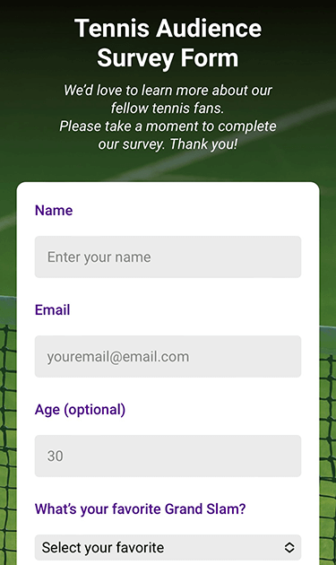
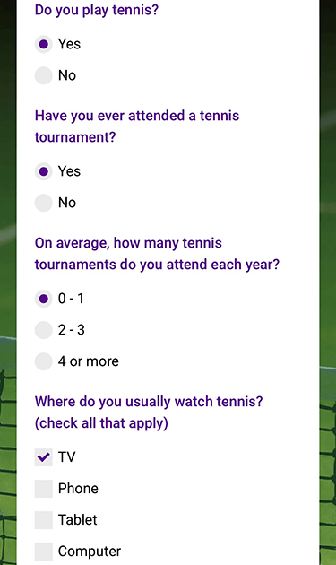
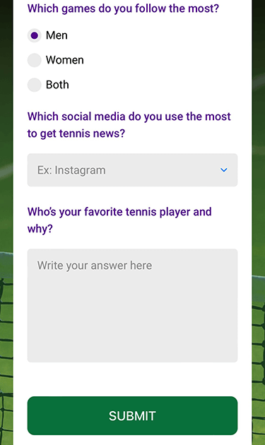

# freeCodeCamp - Survey Form

Project created for the Responsive Web Design Certification from <a href="https://www.freecodecamp.org/learn">freeCodeCamp</a>.

## Technologies

- HTML/CSS

## Link

- Live Site URL: [CodePen](https://codepen.io/julianachagas/full/zYwXLKV)

## Layout

### Web 🖥️

 <br/>

### Mobile 📱

 &nbsp;  &nbsp;  <br/><br/>

## What I learned 

- Custom radio button and checkbox with CSS using `label::before` and `label::after`

```css
.radio-wrap input, .checkbox-wrap input {
  opacity: 0;
  width: 0;
  height: 0;
}

.radio-wrap label::before, .checkbox-wrap label::before {
  content: "";
  position: absolute;
  width: 20px;
  height: 20px;
  top: 0;
  left: 0;
  background: var(--light-gray);  
  display: inline-block;
}

.radio-wrap label::before {
  border-radius: 50%;
}

.radio-wrap input:checked + label::after {
  content: "";
  position: absolute;
  display: inline-block;  
  top: 5px;
  left: 5px;
  border: 5px solid var(--purple);
  border-radius: 50%;
}

.checkbox-wrap input:checked + label::after{
  content: "";
  position: absolute;
  display: inline-block;
  top: 2px;
  left: 6px;
  width: 8px;
  height: 12px;
  border: solid var(--purple);
  border-width: 0 3px 3px 0;
  transform: rotate(45deg);
}
```
<br/>

- CSS property `background-attachment: fixed` doesn't work well on mobile. This is the mobile friendly alternative:

```css
body::before {
  content: "";
  position: fixed;
  top: 0;
  left: 0;
  height: 100%;
  width: 100%;
  z-index: -1; 
  background-image: linear-gradient(0deg, rgba(20, 160, 62, 0.3), rgba(0, 0, 0, 0.4)), 
                    url(images/wimbledon-tennis-grass-court.jpg);
  background-size: cover;
  background-repeat: no-repeat;
  background-position: center;  
}
```
***
##### Made with 💜 by Juliana Chagas 
